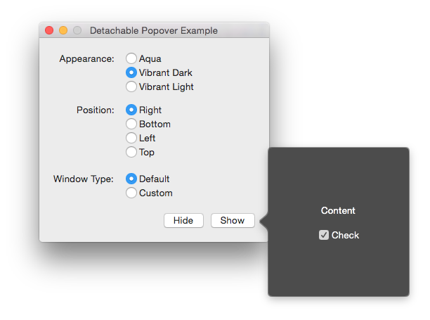

# DetachablePopoverExample

This example application shows the [new behavior](https://developer.apple.com/library/mac/releasenotes/AppKit/RN-AppKit/#10_10ViewController) of detaching popovers in OS X Yosemite. Its goal is to modernize the outdated sample application [Popover](https://developer.apple.com/library/mac/samplecode/Popover/Introduction/Intro.html) developed by Apple. This is achieved by using the new API of [`NSPopover`](https://developer.apple.com/library/mac/documentation/AppKit/Reference/NSPopover_Class/index.html) (`NSAppearance` & default detached windows), Swift and OS X Storyboards.

## Detached Window Types

**Default detached windows:** When using the default behavior of `NSPopover` an implicit detached window is created. This has the same appearance as the popover and reuses the content view controller of the popover.

**Custom detached windows:** Additionally, a custom detached window can be provided to `NSPopover`. In this case the content of the popover represented by the view controller is not moved to the new window and the developer has the responsibility to adjust the content of the custom window. Moreover the content view controller of the popover can't be directly reused for this purpose. The only possibility is to create a new instance.

## Screenshot

